# 📚 Desafio 30 Dias de CSS
Olá, Mundo.

Este é um repositório para guardar minhas soluções
para o desafio #30diasDeCSS

O Desafio foi idealizado originalmente pela [Milena Carecho](https://github.com/MilenaCarecho/) 

Você pode conhecer o repositório original do projeto clicando [Aqui](https://github.com/MilenaCarecho/30diasDeCSS).

# 🚀 Objetivo
A ideia geral é melhorar as habilidades com CSS criando um mini projeto por dia durante 30 dias. 

## Dia 01 - Icones de mídia social em camadas

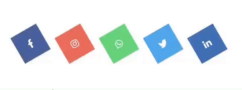

## Dia 02 - Gradient Loader

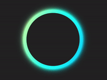

## Dia 03 - Coração Animado

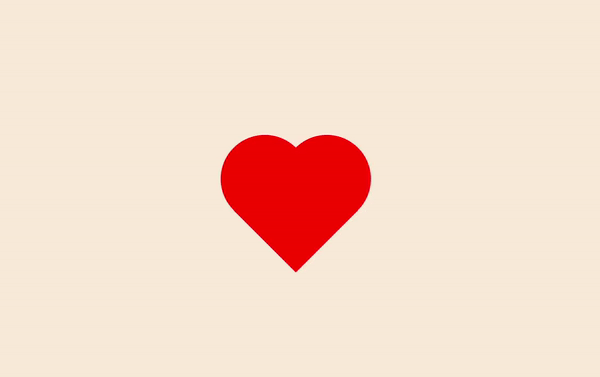

## Dia 04 - Pacman

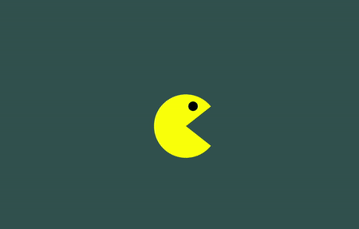

## Dia 05 - Lâmpada + Iluminação no texto

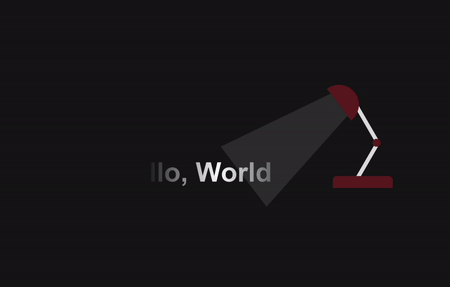

## Dia 06 - Like do Intagram

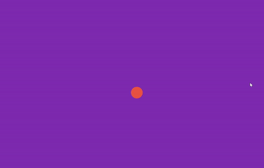

## Dia 07 - Botão Play SVG

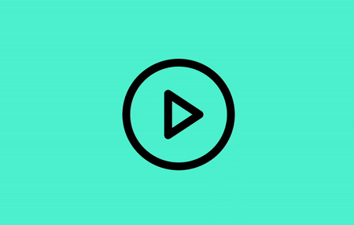

## Dia 08 - Loader de Onda

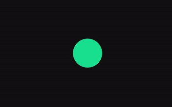

## Dia 09 - Loader Cubos

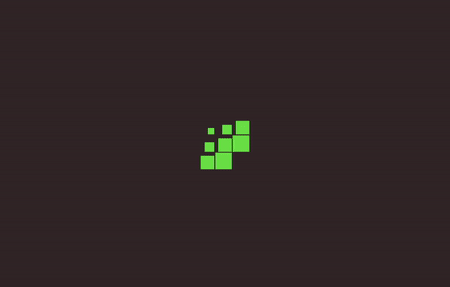

## Dia 10 - Animação Jogo Pong

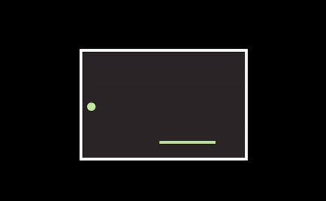

## Dia 11 - Efeito de Pulso

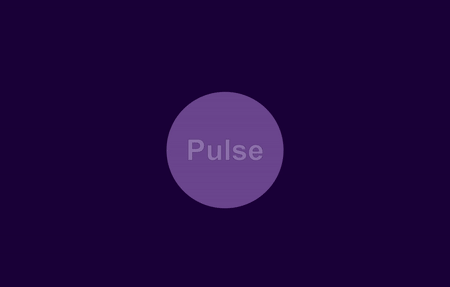

## Dia 12 - Cards em formato de fotos

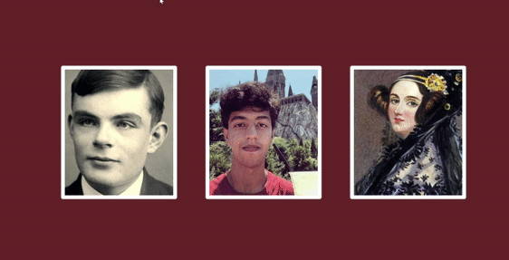

## Dia 13 - Flip Cards

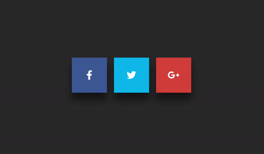

## Dia 14 - Linha Mágica (Hover Effect)

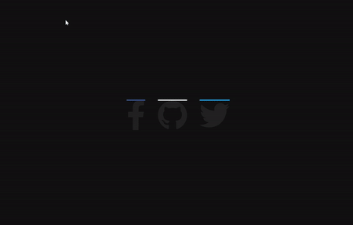

## Dia 15 - Galeria 3D

## Dia 16 - Botão Dark Mode

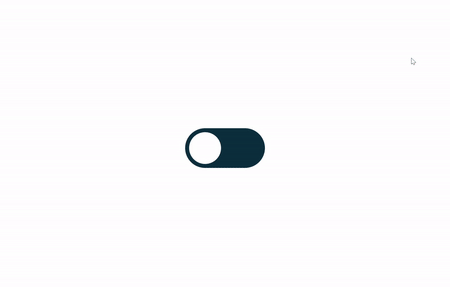

## Dia 17 - Botões Neon

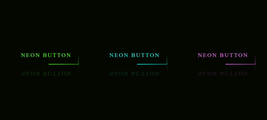

## Dia 18 - Card com botão para mais informações

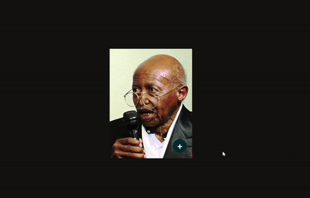

## Dia 19 - Botão com efeito de fundo liquido

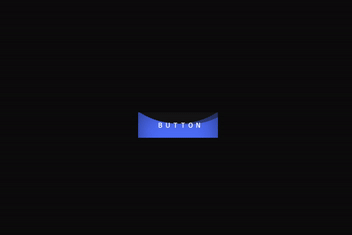

